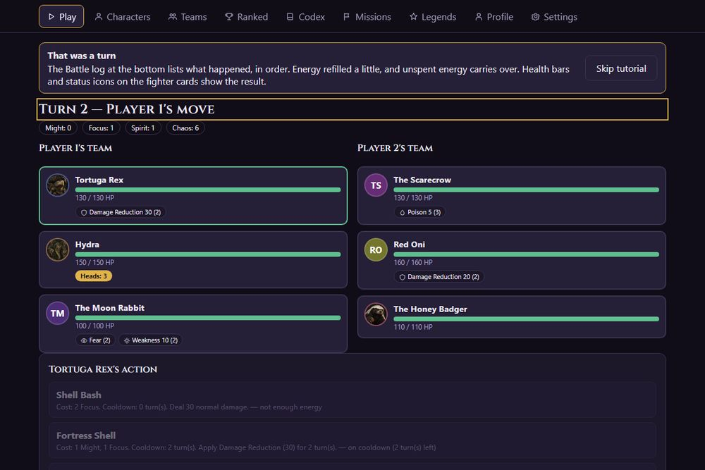
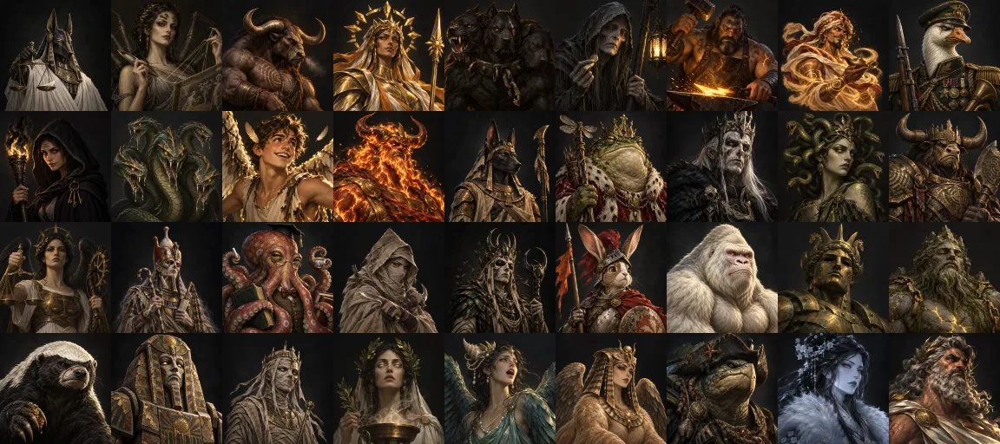

# Veilbreak: Arena of the Fallen

[](https://github.com/Mrbeanington/Veilbreaker/actions/workflows/ci.yml)

An original, browser-based **3v3 turn-based arena game**. Draft three fighters from a roster of 119, spend shared team energy, and out-think your opponent. Abilities are simple; the depth comes from counters, transformations, hidden triggers and team composition.

**[Play it](https://mrbeanington.github.io/Veilbreaker/)** · **[Project hub and player wiki](https://claude.ai/artifact/CZPeCuznjEnsUJcVNTz2SE)** (every fighter, the rules, statuses and project status)

It runs entirely in your browser. There is no server, no account and no network needed once loaded. Progress is saved on your device, and the whole game also comes as a single `.html` file you can open from disk.

> Status: playable, and feature-complete for a first playtest. Art is still being made (36 of 119 portraits so far), and real-player testing has not started. See [`docs/ROADMAP.md`](docs/ROADMAP.md).



## Play

Open the link above, take the short guided tutorial, then choose a mode:

| Mode | What it is |
|---|---|
| **Vs. AI** | Face a bot at four skill levels, Beginner to Expert |
| **Legend Trials** | Beat a Legend and its two allies (boss AI) to unlock it |
| **Ranked Ladder** | A local ladder with a hidden rating, divisions, placements and seasons. Opens at level 3 |
| **Local Hotseat** | Two players on one device |
| **Friend Match** | Play a friend with swapped codes or links, no server. Moves are locked in secretly and the match is verified by replaying it |
| **Replays** | Watch any finished match again, exactly |

**How a match works.** Each player secretly picks an action for each living fighter, spending energy from one shared pool (Might, Focus, Spirit, Chaos, plus Neutral). When both lock in, the turn resolves in a fixed order. Defeat all three enemy fighters to win. The Codex in the game explains energy, the damage scale, the turn order, roles and every status.

**Progression.** You start with 24 fighters. Every other fighter is unlocked by a short **quest** (win with a particular fighter or role, win quickly, win without losing anyone, and so on), listed under Missions. Legends also need an account level, a quest and a won trial. Levels unlock cosmetic titles and portrait frames, and each fighter's mastery adds a bronze, silver or gold ring to its portrait. Nothing can be bought.



## The roster

119 playable fighters drawn from public-domain myth and folklore, given original designs and kits: 23 Core, 70 Rare, 14 Secret and 12 Legendary. Every Legend and every rule-breaking "Cheater" has a counter. Kits are data (abilities, statuses, triggers, transformations, summons), not code, so the engine is the only place rules live.

## Design goals

- **Simple abilities, deep interactions.** Any ability reads in about five seconds.
- **Deterministic engine.** Same seed, same actions and same balance version give the same result on every device. Integer math only. The battle log is a first-class output that replays and the UI both read.
- **Client-only.** No backend, database, accounts or third-party services. Friend matches are verified by commit-reveal and state hashes; saves are IndexedDB plus backup files, QR and link transfer.
- **Original.** No borrowed characters, art, names or code.
- **Powerful is acceptable, uncounterable is not.**

## For developers

Requirements: Node 20 or newer, pnpm.

```bash
pnpm install
pnpm --filter @veilbreak/web dev     # dev server
pnpm run ci                          # typecheck, lint, tests, build and every guard, same as CI
pnpm build:single                    # one self-contained apps/web/dist-single/veilbreak.html
```

| Package | Role |
|---|---|
| `packages/engine` | Pure battle engine: resolver, energy, statuses, triggers, RNG. No I/O |
| `packages/content` | Fighters, statuses, balance patches, schemas, art specs, tooltips |
| `packages/ai` | Bots, headless simulator, ladder meta pool |
| `packages/persistence` | Saves, migrations, backups, QR transfer codes, replays |
| `packages/protocol` | Serverless friend-match protocol |
| `apps/web` | React and Vite app, installable as a PWA |

Useful tools:

| Command | Purpose |
|---|---|
| `pnpm sim --matches 20000 --bots intermediate` | Balance simulation report |
| `pnpm meta` | Refresh the ranked ladder's meta pool |
| `pnpm art:portraits`, `pnpm art:splashes` | Prompt files for image generation |
| `pnpm art:import <folder>`, `pnpm art:status` | Shrink and import portraits and splashes, coverage |
| `pnpm playtest:report <folder>` | Read playtest report codes |
| `?dev=1` on a dev build | Balance workbench and simulation dashboard |

## Documentation

- [`CLAUDE.md`](CLAUDE.md): operating guide and non-negotiables. [`docs/ARCHITECTURE.md`](docs/ARCHITECTURE.md): how the pieces fit.
- [`docs/spec/`](docs/spec): the design source of truth (rules, engine, roster, art direction, UI, platform, testing).
- [`docs/DECISIONS.md`](docs/DECISIONS.md): every architectural decision (50 so far). [`docs/OPEN-QUESTIONS.md`](docs/OPEN-QUESTIONS.md): open questions and their defaults.
- [`docs/PROGRESS.md`](docs/PROGRESS.md) and [`docs/phases/`](docs/phases): the phase-by-phase build log.
- [`docs/balance/`](docs/balance): simulation reports and each balance patch. [`docs/design/balance-workflow.md`](docs/design/balance-workflow.md): how to change a number.
- [`docs/art/`](docs/art): art pipeline and prompt files. [`docs/PLAYTEST.md`](docs/PLAYTEST.md): running a playtest. [`docs/ROADMAP.md`](docs/ROADMAP.md): what comes next.

## How it was built

Built phase by phase with [Claude Code](https://claude.com/claude-code) against a fixed spec, with tests for every mechanic and CI guards for the client-only rule, bundle size, accessibility and offline behaviour. Portraits are generated with an AI image tool from the prompts in `docs/art/` and reviewed by hand. Art drawing on living traditions is marked as draft until someone from or expert in those traditions has reviewed it.

## License

No license has been chosen yet, so all rights are reserved for now.
